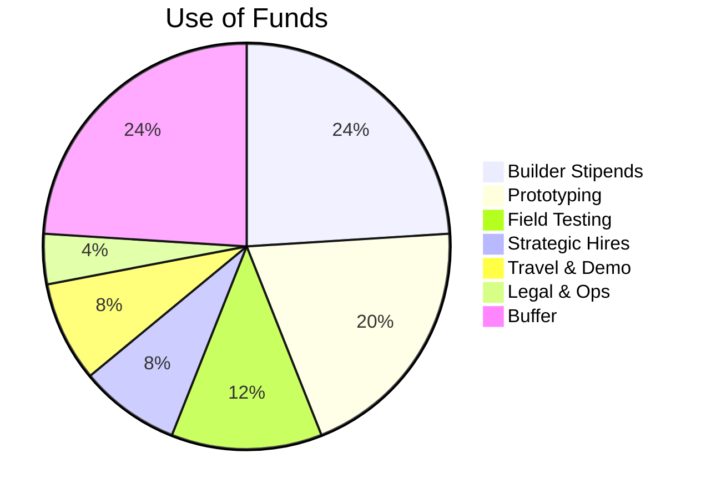
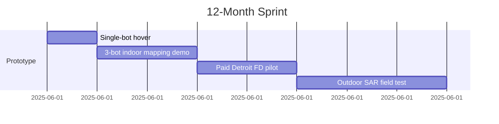

<!--
marp: true
theme: default
paginate: true
-->

# Drooid Swarm  
### Modular nanodrone swarms for impossible jobs  
Fitz Doud · Daniel Kalu · May 2025

---

## Problem

- **Too dangerous:** collapsed buildings, toxic gas leaks  
- **Too remote:** flooded tunnels, underwater pipework  
- **Too complex:** GPS‑denied, dynamic, or unmapped geometry  

> Current robots are big, brittle, single‑purpose.  
> First responders still put humans in harm’s way.

---

## Solution

| Component | What it does |
|-----------|--------------|
| Swarm bots | Fly · crawl · swim, palm‑size |
| AI‑to‑Print | GPT‑CAD → 3‑D print in 72 h |
| Feasibility engine | Filters impossible tasks |
| Hive Box | Edge compute & comms hub |
| Book of Nature | Learns what works where |

---

## Use of Funds – $500k SAFE Raise

> **This is not a $500k pitch to finish an idea.  
> It’s a $500k sprint to prove a new class of robotics is ready for the field, and ready for scale.**

---

## Timeline Milestones

---

## The Ask

**Raise:** $500k via post‑money SAFE @ $6M cap  
**Runway:** 12–15 months  
**Target:** 10‑bot field demo + paid pilot

_Let’s build the swarm that keeps people out of danger._
