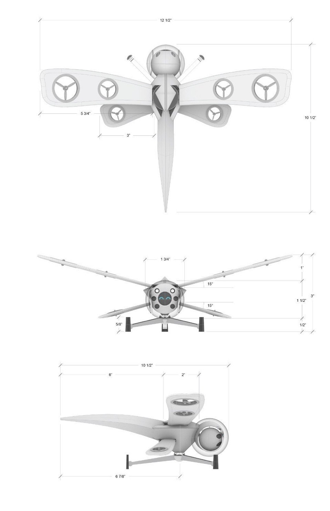
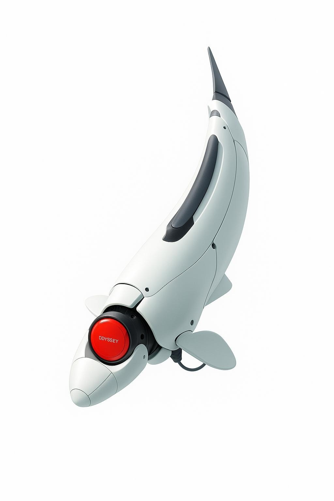
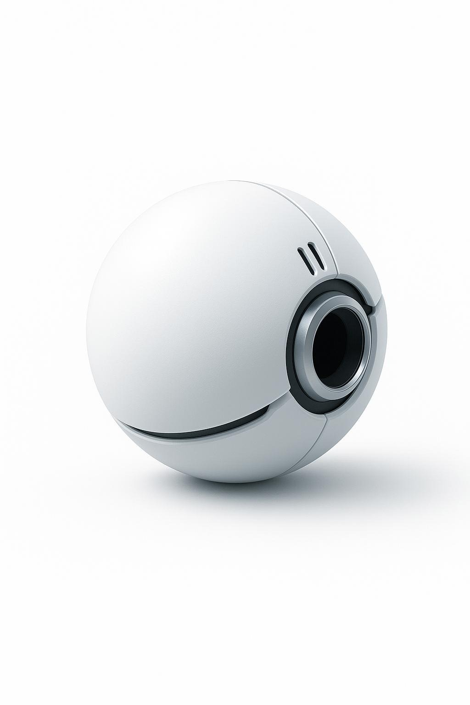
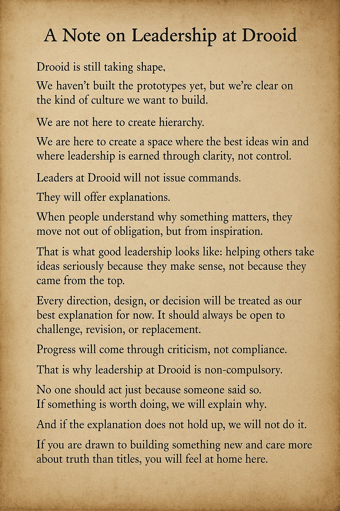

<!--
marp: true
theme: default
paginate: true
header: "Drooid · 2025"
footer: "© 2025 Drooid Technologies"
style: |
  section.lead {
    text-align: center;
    padding: 4em 2em;
  }
  section.lead h1 {
    font-size: 3em;
    margin-bottom: 0.2em;
  }
  section.lead h3 {
    color: var(--secondary-color);
    font-weight: 400;
  }
  section.lead p {
    margin-top: 2em;
    font-size: 1.4em;
  }
-->

<!-- _class: lead -->
# Drooid – modular nanodrone swarms for impossible jobs  
Daniel Kalu and Fitz Doud · May 2025  

---

## 2  |  Problem  
**Real-world tasks nobody can do safely or cheaply today:**  
- Too dangerous: collapsed buildings, toxic gas sites  
- Too remote: tight caves, flooded tunnels, underwater pipework  
- Too complex: GPS-denied, dynamic, or unmapped geometry  

Current robots are too big, brittle, and single-purpose. First responders and field scientists still rely on humans in harm's way.

Swarm systems provide resilience: if one bot fails, others can complete the mission. Centralized designs don't offer that.  

---

## 3  |  Solution  
**Swarms of palm-size drones & crawlers that team up like insects**  
- Fly · Crawl · Swim units mix & match per mission  
- Rapid AI-to-Print pipeline → new design in days, not months  
- Physics-checked missions = higher success, lower loss rate  

---

## 4  |  Why Now  
- Battery energy density ↑ 2× in 8 years  
- On-device AI chips < $100  
- Newlab Michigan Central gives us $500k of prototyping gear for $0 cap-ex  

Timing is perfect for field-ready swarms.  

---

## 5  |  Tech Stack (Core Components)  
- **Swarm Hardware Prototypes** – lightweight, modular nano-bots  
- **AI-to-Print Pipeline** – GPT-CAD → 3D print → bench in <72 h  
- **Constructor-Theory Feasibility Engine** – filters impossible tasks  
- **Hive Box** – backpack hub that offloads compute & comms  
- **Book of Nature** – growing database of what tasks work where  

---

## 5.1 | Biomimetic Swarm Designs
### Field-Ready Forms Inspired by Nature

"These designs are not theoretical art — they are reference points for real, buildable nano-robotic swarms."

- Bioinspired forms allow stealth, agility, and mission adaptability.
- Each unit is task-specific: fly, crawl, swim.
- Compact, field-deployable, and fit in backpack kits for real-world missions.
- Feasible today — prototyping can begin now with COTS parts and rapid fabrication.

---

## 5.2 | Dragonfly-Class (Aerial Recon Drone)

  
  

    <strong>Use Cases:</strong>
    <ul>
      <li>Indoor or outdoor search-and-rescue</li>
      <li>Gas leak scouting</li>
      <li>Rooftop or tunnel ventilation analysis</li>
      <li>Infrastructure inspection (bridges, fire zones, under-roof)</li>
    </ul>
    <strong>Mission Features:</strong>
    <ul>
      <li>Vertical Takeoff (VTOL) for tight spots</li>
      <li>Stable hover for high-res imaging</li>
      <li>Forward flight for perimeter sweeps</li>
      <li>Ducted fans for safety in indoor/confined spaces</li>
    </ul>
    <strong>Example Mission:</strong>
    <blockquote>Map an unstable, GPS-denied building after an earthquake to find safe entry points and gas concentrations.</blockquote>
    <em>Wings and body are designed for maximum lift and maneuverability in cluttered environments.</em>
  

---

## 5.3 | Fish-Class (Aquatic Recon Drone)

  
  

    <strong>Use Cases:</strong>
    <ul>
      <li>Flooded tunnel inspection</li>
      <li>Urban storm drain mapping</li>
      <li>Nuclear cooling pool or marine site monitoring</li>
      <li>Environmental water testing</li>
    </ul>
    <strong>Mission Features:</strong>
    <ul>
      <li>Silent aquatic motion using biomimetic flippers</li>
      <li>Sensor payloads for salinity, turbidity, pressure</li>
      <li>Can relay data back via surface drones or swarm beacons</li>
    </ul>
    <strong>Example Mission:</strong>
    <blockquote>Swim through a collapsed sewer line to detect chemical spills and structural damage.</blockquote>
    <em>Streamlined for low drag and equipped for tight underwater navigation.</em>
  

---

## 5.4 | Orb-Class (Communication/Rescue Ball Drone)

  
  

    
    <strong>Use Cases:</strong>
    <ul>
      <li>Two-way communication with trapped victims</li>
      <li>Swarm node or repeater for underground swarms</li>
      <li>Deployed in disaster rubble by rolling or air-drop</li>
    </ul>
    <strong>Mission Features:</strong>
    <ul>
      <li>Loudspeaker + mic for emergency teams</li>
      <li>Flashlight beacon for visibility</li>
      <li>Ruggedized outer shell for chaotic debris fields</li>
      <li>150 ft voice range, hands-free operation for victims</li>
    </ul>
    <strong>Example Mission:</strong>
    <blockquote>Drop into a collapsed mine shaft to establish comms with trapped workers and light the interior.</blockquote>
    <em>Designed for maximum durability and clear audio in harsh environments.</em>
  

---

## 5.5 | Why This Matters
- Each class does one job well.
- They operate in dangerous, unmapped, or GPS-denied zones.
- Together, they form a swarm that can map, measure, and communicate across terrain types.

---

## 6  |  Unique Edge  
Most robotics platforms rely on statistical guesswork. Drooid is vertically integrated from physical limits up:

- Swarm designs, fabrication, and deployment are rapid and tightly coupled—changes in the field inform redesigns overnight.
- Hardware, software, and operating logic co-evolve as one system, not siloed tools stitched together.
- Constructor-theoretic feasibility checks reject doomed tasks before they waste energy, crash, or fail silently.
- Vertical stack from mission to motor—we control task spec, part design, swarm logic, and field deployment.
- Rapid deployment capability—we can take a new mission concept and produce a deployable swarm in under a week.
- Every failed mission teaches the system—the Book of Nature captures feasibility data and improves task success over time.

This leads to: fewer crashes, faster iteration, and a clearer ROI for high-risk, high-value field deployments.

---

## 6.1 | Vertical Integration Advantage  
"Vertical integration is an under-explored modality of technological progress." — Peter Thiel

- **Drooid owns the full stack**: hardware, AI design, feasibility OS, and swarm data.  
- **Atoms + Bits under one roof** at Newlab: design, print, test, and deploy in a single loop.  
- **No middle layers**: Hive Box and Book of Nature keep intelligence local.  
- **Hard to copy**: our vertically integrated pipeline is like a Tesla gigafactory for swarm robotics.

---

## 6.2 | Project-First Philosophy  
"Let it be a project before it's a company." — Sam Altman

- This is not a $500k pitch to finish an idea.
- It's a $500k sprint to prove a new class of robotics is real, field-ready, and scalable.

### Pre-seed = Proof of Feasibility
- Fund 3-bot swarm demo + cost curve BOM
- Validate physics, unit economics, and demand before scale
- Spin into full product company only after technical signal is clear

**Investors aren't buying hype. They're backing the search for scalable reality.**

---

## 7  |  Business Model  
**Hardware + "Swarm-as-a-Service"**  
- Starter kit (10 bots + Hive Box): $25k COGS $8k  
- Software & maintenance: $1k / mo / swarm  
- Beachhead = fire & rescue → expand to mining, energy, env-monitoring  

---

## 7.1 | Market Focus—Jobs We Solve

Instead of slicing the market by customer type, Drooid targets *critical jobs that no existing tool completes well.*

| Job to Get Done                                   | Current Pain                                                         | Drooid Swarm Advantage                                                                      |
|---------------------------------------------------|----------------------------------------------------------------------|---------------------------------------------------------------------------------------------|
| Map a collapsed or smoke-filled structure in <5 min | Manual entry is lethal and slow; ground robots fail on rubble        | Air-hover nano-bots create a real-time 3-D map plus toxic-gas overlay in a single flight    |
| Inspect a flooded tunnel without draining it      | Divers and ROVs are bulky, costly, risky                             | Fish-class swimmer navigates tight bends and streams HD video live                          |
| Relay comms deep underground                      | Radio blackouts stall rescue operations                              | Orb-class relay bot forms an instant mesh network that follows the team                     |
| Sense methane leaks across sprawling well pads    | Helicopters are expensive; fixed sensors miss moving plumes          | Dragonfly flyers sweep grids autonomously and cut per-acre cost by an order of magnitude    |

**Why this matters**  
When customers face these jobs, Drooid is the obvious hire: precise, fast, and safer than humans or legacy machines.  
Each job anchors pricing, product specs, and go-to-market—keeping R&D and sales laser-aligned on real value.

---

## 8 | Summer Build Plan (June–August)

We're building Drooid's first working swarm this summer. Hardware, AI, swarm logic, and control systems—everything built and tested by end of August.

### Bi-Weekly Plan (Part 1)

| Date Range    | Focus                               | Outcome                             |
|---------------|--------------------------------------|--------------------------------------|
| May 27–Jun 2  | Order parts, set up Jetson + ROS     | Tools ready, test board boots        |
| Jun 3–16      | Print first bots, build swarm base   | First bots fly, basic swarm script   |
| Jun 17–30     | Finish 3-bot swarm, run formations   | Indoor swarm flight tested           |
| Jul 1–14      | Build fish drone, test air-water     | Cross-medium handoff works           |

---

## 8.1 | Summer Build Plan (June–August) (cont'd)

### Bi-Weekly Plan (Part 2)

| Date Range    | Focus                               | Outcome                             |
|---------------|--------------------------------------|--------------------------------------|
| Jul 15–28     | Run full demo, prep for outdoor      | Mission runs start to finish         |
| Jul 29–Aug 11 | Outdoor mapping + leak detection     | Swarm detects and logs field tasks   |
| Aug 12–25     | Final fixes, polish swarm control    | Stable, reliable swarm system        |
| Aug 26–31     | Demo + pitch prep                    | System ready for seed raise          |

**Goal:**  
Have a 5-bot swarm system completing real-world tasks by end of August.  
Use it to start seed fundraising and pilot outreach in September.

---

## 9  |  Use of Funds  
**Ask: $500k SAFE, post-money cap $6M**  

| Category                       | Amount | Purpose                                                          |
|-------------------------------|--------|------------------------------------------------------------------|
| Builder Stipends (4 builders) | $120k  | $2.5k/month avg to live and build full-time                     |
| Prototyping + BOM Materials   | $100k  | Covers parts for ~20 swarm bots, sensors, Hive Box rebuilds     |
| Field Testing + Pilot Support | $60k   | Permits, insurance, facilities, field logistics                  |
| Strategic Hires               | $40k   | Short-term CAD, AI, or swarm contractors                        |
| Travel + Demo Missions        | $40k   | VC meetings, pilot site visits, government demos                 |
| Legal & Ops                   | $20k   | SAFE paperwork, IP, incorporation                               |
| Runway Buffer                 | $120k  | 5–6 month buffer in case grants delayed                        |

**This is not a $500k pitch to finish an idea.**  
**It's a $500k sprint to prove a new class of robotics is ready for the field—and ready for scale.**

---

## 10 | Non-Dilutive Grant Applications

We're actively pursuing early-stage grant funding to extend investor runway and support local prototyping in Michigan.

| Grant Program                       | Status            | Amount       | Purpose or Focus Area                                           |
|------------------------------------|-------------------|--------------|------------------------------------------------------------------|
| **𝑓(LUX) Fellowship**              | Submitted         | $15,000      | Physical science builder grant with mentorship                   |
| **20Fathoms Small Business Grant** | Submitted         | $4,500       | Equipment or capacity-building support for Traverse region       |
| **AAM Activation Fund (Michigan)** | Submitted         | $175,000     | Drone infrastructure, testing, and aerial mobility applications  |
| **NSF SBIR Phase I**               | Not yet applied   | $275,000     | Feasibility and tech validation for deep-tech startups           |
| **AFWERX Tactical Funding**        | Not yet applied   | $75,000      | Government and dual-use applications                            |
| **Michigan SPARK Prototype Grant** | Not yet applied   | $100,000     | Matching grant for prototyping and hardware iteration            |

**Summary**  
These grants don't define our runway, but they help us move faster with less dilution. Every dollar extends our testing capacity and accelerates outcomes for investors.

---

## 11 | Early-Investor Value Proposition (June 1 kickoff)  
**Your job-to-be-done as a pre-prototype investor:**

- **De-risk core physics + manufacturing loop** — fund the sprint that proves 3-bot swarm can go design-to-flight in <30 days  
- **Secure seat in complex monopoly** — vertical stack = long-term moat  
- **Shape the platform** — direct input into BOM, vendors, and first use case  
- **Price advantage** — $6M cap SAFE now vs $15M cap post-revenue  

**Milestone your check enables by Aug 31:**  
10-minute autonomous gas-mapping demo with 3 nano-drones in Detroit tower.

---

## 12 | The Ask  
Invest $500k via SAFE @ $6M cap  
Funding gets us to swarm demo + paid pilot inside 12 months.  
**Let's build the swarm that keeps people out of danger.**

---

## Team & Newlab Advantage
- Fitz Doud – robotics platform engineer, ex-open-source maintainer  
- Daniel Kalu – CS grad from Minerva, AI/ML & swarm control  
- Newlab @ Michigan Central – SLA/SLS printers, drone cage, motion-capture lab

**Thank You**

Contact:
fitzdoud@gmail.com
dankalu.work@gmail.com

Join us in building the future of rescue robotics.

---

## Drooid Leadership

