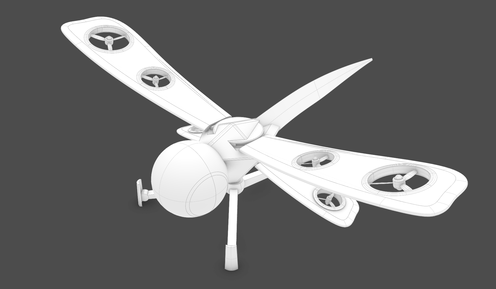
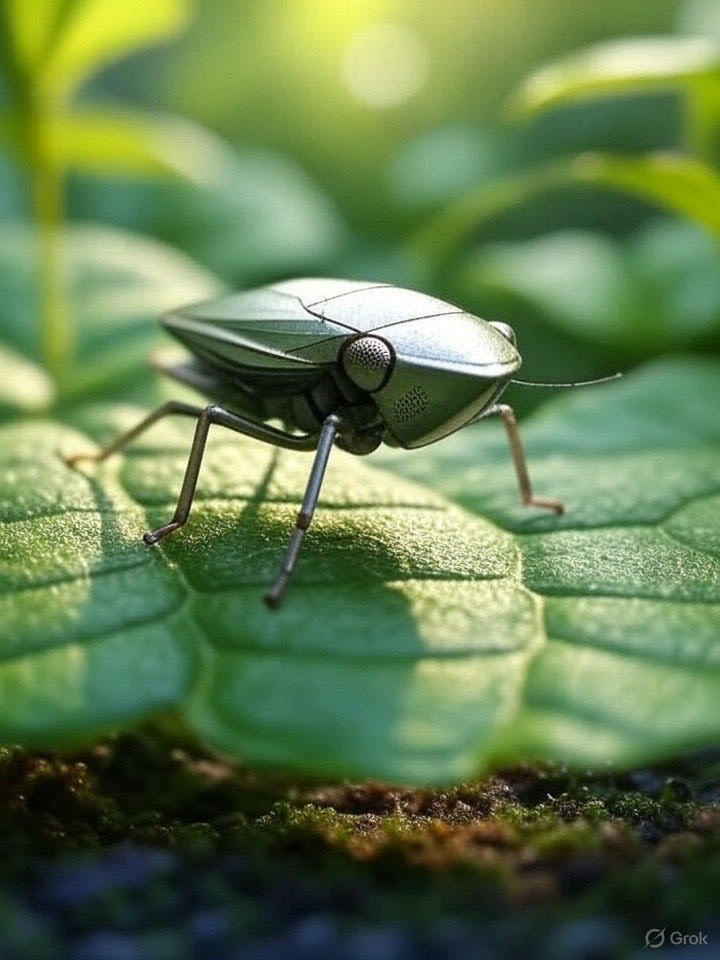

# Drooid: palm-size swarms for modern battlefields  
Daniel Kalu & Fitz Doud · July 2025

---

### **Problem**

**Modern battlefields demand scalable, intelligent, and expendable systems  but current robotics are:**

- Too large and expensive to deploy at scale
- Reliant on GPS and centralized control
- Vulnerable to jamming, destruction, or environmental limits
- Require too much operator input and training

> Result: Mission teams lack agile, intelligent assets for ISR, breaching, and multi-domain coordination in denied environments.

"75% of military casualties occur during reconnaissance and patrol missions" - DoD Combat Studies

---

### **Solution**

**Drooid builds insect-like teams of autonomous drones & crawlers that:**

- Think and coordinate like swarms  no single point of failure
- Operate in GPS- and comms-denied zones
- Are palm-sized, quiet, and rapidly manufacturable
- Perform recon, mesh networking, breaching, and perimeter defense

> **Think: "100 brains over one body" for modern tactical advantage.

---

### **Why Now?**

- **DoD is buying swarms now**  
  Replicator, DIU sUAS, and AFWERX TACFI all fund low-cost, attritable autonomy.  

- **Edge-AI + batteries finally fit in a palm**  
  Jetson Orin Nano / RK3588 boards **< $100** + 350 Wh/kg cells ⇒ 15 min endurance with on-board inference.  

- **GPS-denied wars expose the gap**  
  Ukraine, Gaza, and looming Indo-Pac flashpoints show the cost of losing ISR and comms.  

- **Prototype loop is instant**  
  Newlab Detroit's printers, drone cage, and motion-lab let us go **prompt → flight test in < 72 h** with zero cap-ex.  

---
### **Biomimetic Swarm Designs**

Field-ready forms inspired by nature.  
Each unit built from COTS parts and rapid printing.

- **Dragonfly** flyer – indoor or outdoor recon  
- **Fish** swimmer – flooded tunnel and drain mapping  
- **Orb** comm ball – drops in rubble to relay voice and data

All designs are backpack-deployable and task-specific.

---

---

<!-- end bg -->

---

### **Product Overview - Drooid Tactical Swarm Kit**

| Module | Role in a DoD mission |
|--------|-----------------------|
| **Micro Flyers** | Palm-scale ISR drones for room-clearing, rooftop sweeps, and perimeter alarms |
| **Ground Crawlers** | Low-profile scouts that breach door gaps, map tunnels, and drag comm beacons forward |
| **Swappable Payloads** | Snap-in HD / IR cams, CBRN & gas sensors, EW sniffers, breaching spikes |
| **HiveBox Field Hub** | One ruck-size charger + mesh gateway that boots and re-arms 20 bots anywhere |

**Starter Load-Out:** 10 flyers + 10 crawlers + HiveBox, stowed in a single Pelican-spec case — deployable by one operator in < 5 min.

---

### **Core Tech Stack (Prototype v0)**

| Pillar            | Ships in the first 6 months                            | Why it matters                                   |
|-------------------|--------------------------------------------------------|--------------------------------------------------|
| **Nano-Bots**     | 10 flyers + 10 crawlers, printed frames, COTS sensors  | Cheap, expendable, backpack-deployable           |
| **SwarmOS Lite**  | Decentralized nav, mesh comms, hard kill-switch        | Keeps running when GPS or radio is jammed        |
| **HiveBox**       | Laptop-size field base: compute, charger, data logger  | One plug-in hub powers & coordinates the swarm   |
| **AI-to-Print**   | Prompt → CAD → 3-D print in **48 h**                   | Hardware iterations move at software speed       |

> **Focus:** prove this minimal full stack first—then add swimmers, advanced payloads, and the Constructor engine after Series A.

---

### **DoD Applications**

**Special Operations** – silent advance recon, perimeter sensors  
**FOB Security** – twenty-four seven autonomous fence patrol  
**Urban Warfare** – room-by-room intel and IED spotting  
**Border & Area Denial** – persistent watch with minimal logistics

Drooid scales from platoon kits to base-wide mesh nets.

---

### **Operational Advantages**

| Advantage | Impact |
| --------- | ------ |
| **Redundant swarm** | Mission survives individual losses |
| **Low unit cost** | Affordable mass and attrition use |
| **Adaptive AI** | Replans locally when jammed |
| **Tiny footprint** | Hard to detect and target |

---

### **Market Size and Spend**

Total addressable defense spend **47 B USD**

- Unmanned systems 23 B  
- ISR 18 B  
- Force protection 6 B  

>  Growing DoD budgets in autonomous systems, ISR, and expeditionary robotics

Near-term budgets  
SOCOM 2.1 B • Army ISR 8.3 B • CBP 1.8 B • Classified 0.5 B+

---
### **Go-to-Market Roadmap**

**Phase 1 (0-6 mo)**  
SBIR Phase I wins, exercise demos, DIU pitch

**Phase 2 (6-18 mo)**  
SOF pilot kits, SBIR II, border agency trials

**Phase 3 (18-36 mo)**  
Program-of-Record bids, scale manufacturing, FMS sales

---

### **Tech Differentiators**

- **Decentralized swarm AI** vs traditional single-drone autonomy
- **Ornithopter + crawler dual-domain coordination**
- **Real-time mesh comms + modular payloads**
- **Fully attritable, fast-manufacturable systems**

> No other DoD vendor combines these at palm-scale in both ground and aerial domains

---

### **Business Model**

- 💼 **Direct to DoD (SBIR / DIU / OTA programs)**
- 🤝 Partner with primes as swarm layer for legacy platforms
- 📦 Pack-based unit sales or swarm-as-a-service for specific mission types

---
### **Build Plan · first six months**

| Month | Deliverable |
| ----- | ----------- |
| 1 | Parts in, Li-Po safety SOP and smart-charger station |
| 2 | Frames printed, UWB anchors live, bench tests pass |
| 3 | Indoor hover, crawler roll, kill-switch demo |
| 4 | GPS-denied nav flight in AAIR corridor |
| 5 | Multi-bot sensor sweep, auto-dock recharge |
| 6 | Ten-bot mixed mission video and data pack |

---

### **Funding Ask**

> Raising $250k SAFE @ $3M post-money valuation

- 🚀 Use of funds: Fabricate Gen-1 prototypes, field test ISR swarms, file SBIRs
- 📍 Goal: Demonstrate swarm ISR capability in a denied environment in <6 months

---

### **Team & Newlab Advantage**

**Fitz Doud** – Robotics platform engineer, ex-open-source maintainer  
**Daniel Kalu** – CS grad from Minerva, AI/ML & swarm control  
**Newlab @ Michigan Central (No equity)** – SLA/SLS printers, drone cage, motion-capture lab 

---

### **Thank You**

**Contact:**  
fitzdoud@gmail.com  
dankalu.work@gmail.com

Join us in building the future of swarm defense robotics.
